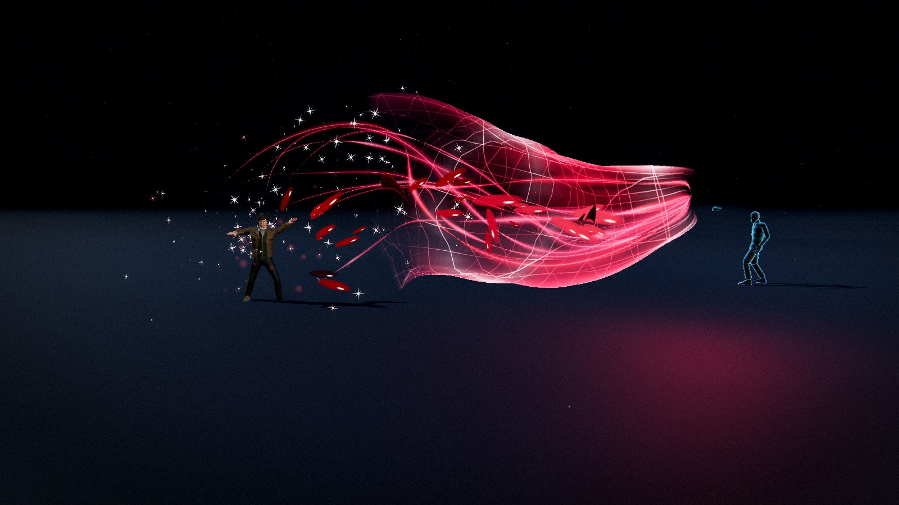
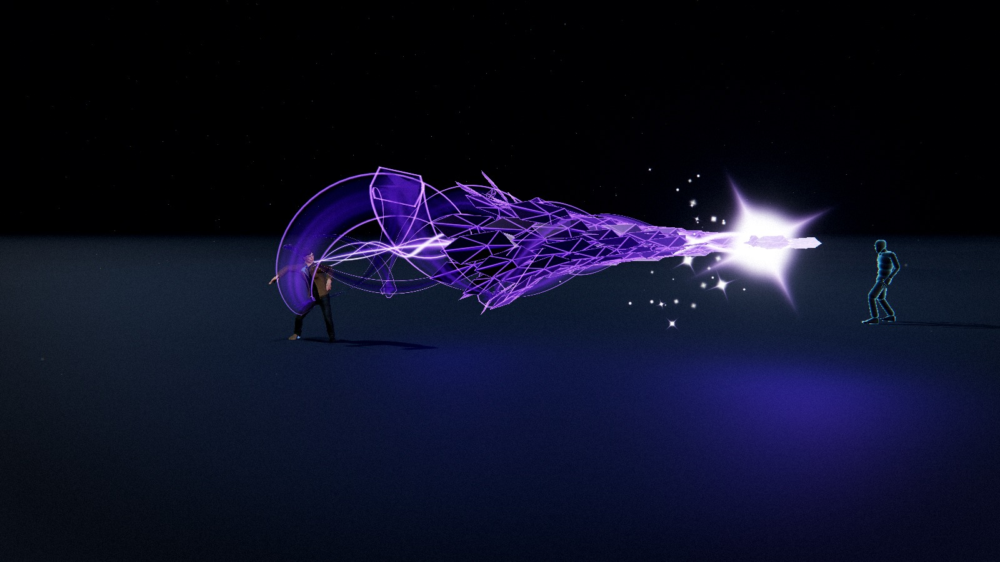
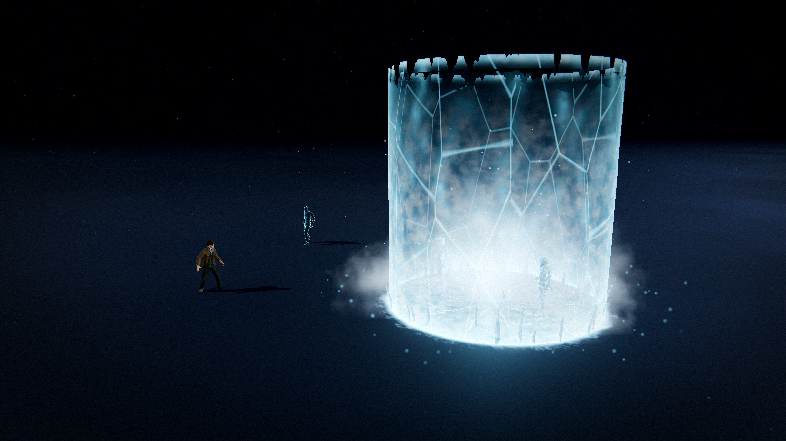
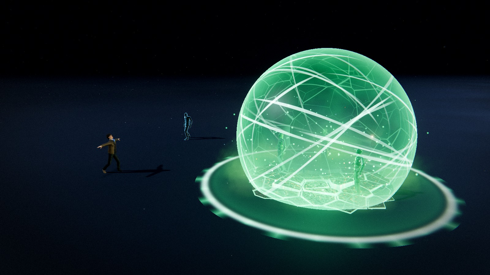
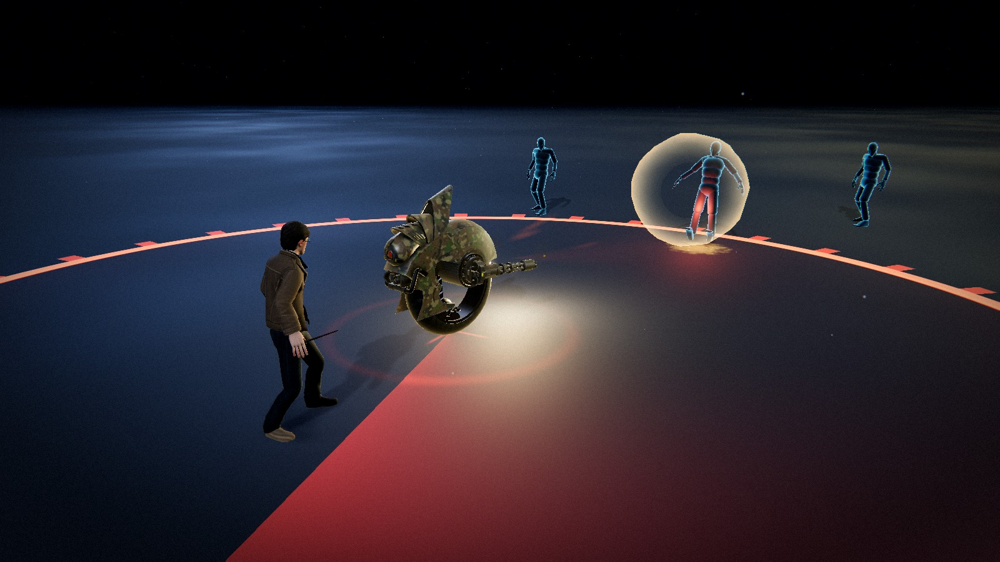
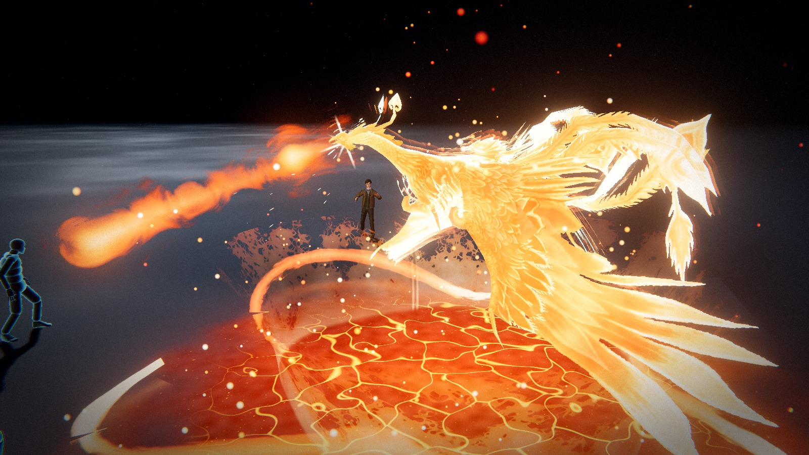
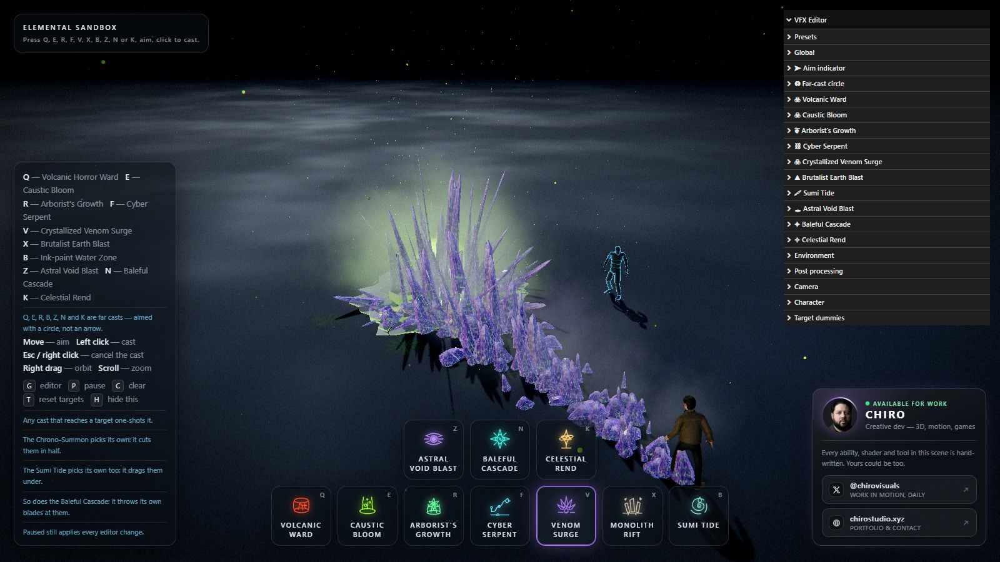

# 엘리멘탈 샌드박스 (Elemental Sandbox)

**Three.js** + **Vite** + 직접 작성한 **GLSL**로 만든 스킬샷 VFX 샌드박스입니다.

[](https://sigco3111.github.io/HandCastAbilityThreeJS/)

라이브 데모 : https://sigco3111.github.io/HandCastAbilityThreeJS/


<p align=center></p>

능력 9개, 조준 방식 3종입니다. 셋은 **직선 시전**: 키를 누르면 장전되고, 리그 오브 레전드식 화살표가 바닥에 나타나 마우스를 따라 회전하며, 클릭하면 발사됩니다. 넷은 **원거리 시전**: 화살표 대신 의도적으로 두꺼운 경계를 가진 원이 커서를 따라다니며, 지면 범위 공격이 확정 전에 답해야 하는 단 하나의 질문 — "이게 얼마나 넓은 면적을 차지하는가" — 에 답합니다. 나머지 둘은 **소환**: 키를 누르면 구조물이 배치되어 조종을 넘겨받고, 다시 누르면 회수됩니다.

> 원본 저장소: [achrefelouafi/HandCastAbilityThreeJS](https://github.com/achrefelouafi/HandCastAbilityThreeJS) (MIT) — 이 저장소는 원본을 클론해 UI와 문서를 한글화한 것입니다. 게임 로직·셰이더는 원본과 동일합니다.

---

## 아홉 가지 능력

이 페이지의 모든 장면은 실행 중인 샌드박스의 렌더러가 직접 출력한 것으로, 시전이 절정에 달한 순간을 포착했습니다. 합성·보정 없이, 앱이 직접 그리지 않는 것은 화면에 없습니다. 슬롯 순서대로, 즉 키 순서대로 나열합니다.



**Q — 혼돈의 떨림** · <sub>직선 시전</sub> — 진홍·장미빛 리본 다발 뒤로 격자 깔때기가 먼저 파고들고, 늘어나는 인대 모양으로 찢긴 핏방울이 따릅니다. 6패널 분해 시트 그대로 구성됩니다: 원뿔 메시 궤적, 유체 핏방울, 혼돈 에너지 리본, 반짝이는 불티, 왜곡 파동, 잔류하는 진홍 티끌 — 모두 이동 거리만의 순수 함수인 하나의 곡선 위에 배치됩니다. 그래서 궤적은 투사체가 실제로 지나온 자리의 기록이 되며, 뒤꽁무니를 따라 헤엄치는 모양이 되지 않습니다.



**E — 직선형 공허 베기** · <sub>직선 시전</sub> — 6패널 분해 시트 기준: 그림자 핵 빔, 입자 잔해, 그림자 리본 궤적, 에너지 불꽃, 왜곡 파동, 잔류 그림자 티끌. 이 능력은 그중 다섯만 그리고 왜곡 파동은 빼서 왜곡 레이어에 쓰지 않으며, 그 외에는 아무것도 더하지 않습니다. 바닥 데칼·압력 껍질·화면 섬광·파티클 시스템 없음. **끝이 먼저** 날아갑니다: 흑요석 창이라는 촘촘하고 뾰족한 형체가 선두이고 나머지는 전부 궤적이며, 뒤로 갈수록 잔해가 넓게 부채꼴로 퍼지니 창이 코, 나머지가 꼬리입니다. 창은 **검은 유리 조각으로 덮인** 뾰족한 외피 — 깎은 흑요석 칩을 한 번의 인스턴싱 드로우로 촘촘히 박아 끝점에서는 화살촉 비늘처럼 겹치고 뒤로 갈수록 들떠 떨어져 나갑니다. 그리고 이것은 *입체*입니다: 깊이를 쓰고 실루엣이 있어, 가산 빔이 절대 가질 수 없는 것 — 그래서 탄두 앞부분이 점으로 읽힙니다.


**R — 빙결 파편 폭풍** · <sub>직선 시전</sub> — 5패널 분해 시트 기준: 내부 얼음 메시, 유체 서리 증기, 정연한 서리 격자, 반짝이는 얼음 파편, 굴절 왜곡. 다섯을 전부 그리고 아무것도 더하지 않습니다. **결정이 먼저** 날아갑니다. 결정은 하나의 절차적 원석 — 바늘 같은 코, 넓은 거들, 깨진 뒷면, 측면에 겹으로 붙은 세 개의 작은 결정 — 으로 *두 번* 그려집니다: 먼저 뒷면을 그리는데, 반투명 돌 너머로 보이는 면이 안쪽 벽의 안면이기 때문이며, 깊은 빙하 블루로 안에서 플랫 셰이딩되고 모서리는 내부 면선으로 보입니다. 그 위에 표면을 반투명하게 덧씌우고, 무대 자체의 HDR 프로브를 반사하는 얼음 프레넬, 하나의 촘촘한 태양 하이라이트, 얇은 코를 뚫고 눈 쪽으로 산란하는 빛이 이어집니다. 타격 시 결정은 면 단위로 분해됩니다 — 모든 삼각형이 강체 파편이 되어 빙글빙글 돌며 하얗게 번쩍이고, 증기가 뿜고, 눈송이·파편 껍질이 던져지고, 렌즈가 큰 링 하나를 쏩니다.


**X — 타락한 파편 생성** · <sub>원거리 시전</sub> — 바닥에 새겨진 룬, 그 밑에서 찢고 올라온 타락한 자수정 군집(첨탑 하나, 검날 링, 파편 스커트), 바닥이 깨지며 치솟는 어두운 물 왕관, 그 둘레를 감는 어둠 안개와 타락 방울, 군집 심장에 점화된 렌즈 별. 6패널 분해 시트 기준에, 합성물이 암시하고 시트에는 없는 한 가지가 더 있습니다: 별은 *광원*이라서, 켜지는 순간 닿는 거리 안 가장 가까운 몸통을 고르고 눈에 보이게 기운을 모읍니다 — 섬광이 부풀고, 모든 결정의 흠이 뜨겁게 달고, 룬 중심이 차오른 뒤 — 그 빛의 빔을 곧바로 쏘아 관통합니다. 맞은 것은 던져진 뒤 안에서부터 타 버립니다.



**B — 빙결 감옥** · <sub>원거리 시전</sub> — 6패널 분해 시트 기준. 잡은 것을 날려 버리지 않고 얼리는 유일한 시전입니다. 시전자 발밑에서 뭔가 뻗어 나가지 않습니다: 감옥은 조준한 그 자리에, 시전된 그 프레임에, 그냥 있습니다. 밑바닥이 얼어붙습니다 — 반경까지 달려 나가는 얼음 판, 반경 너머로 스며들 듯 번지고, *안쪽*에서 빛나는 균열 네트워크. 얼음 기둥이 그 위에서 몸통 높이 두 배로 솟아오릅니다. 그리고 몸통들: 원 안에 서 있던 모든 것이 **선 채로 얼어붙습니다**. 리그의 애니메이션은 숨 쉬다 만 채 버려지고 포즈가 구워져, 스킨 정점이 뼈를 한 번씩 통과해 정확히 서 있던 그 자리에 서는 석상이 됩니다. 발밑부터 결정화 선이 기어오르고, 선 아래는 유리 — 진짜 `MeshPhysicalMaterial`에 클리어코트, 얼음 굴절률, 짙은 블루 너머로 보이는 어두운 몸통. 그 상태로 유지됩니다. 그러다 깨질 이음선을 따라 균열이 기어오르고 **산산조각**납니다: 얼음 조각 마흔 개, 각자 속도와 회전과 중력을 가진 강체로 바깥으로 던져져 바닥에 튀고 미끄러져 누웠다가 녹아듭니다.



**Z — 정복의 맹독 방벽** · <sub>원거리 시전</sub> — 4패널 분해 시트 기준: 결정 방벽 메시, 독가스 장막, 지면 균열 데칼, 방사형 충격파 링. 그 밑에 깔린 하나의 발상 — 전부 같은 유리입니다. 시전자 발밑에서 뭔가 뻗어 나가지 않습니다: 방벽은 조준한 그 자리에, 시전된 그 프레임에, 그냥 있습니다. 밑바닥이 깨집니다: 보로노이 판(`assets/ShatterGeometry.js`)이 갓 잘린 채 각 판의 무게중심마다 융기하고 기울고, 위에 석재 스캔, 모든 이음·벽마다 올라오는 맹독 빛. 그리고 몸통들: 원 안에 서 있던 모든 것이 선 자리에서 **유리로 변합니다**. 리그 포즈가 석상으로 구워지고(빙결 감옥과 같은 방식), 변환은 *파단 셀 단위*로 진행됩니다. 그 상태로 유지되다 이음선이 격자 백색으로 밝아지며 **산산조각**납니다: 파편이 날고, 빙글빙글 돌고, 착지해 유리로 누웠다가 뜨거운 녹색 모서리 뒤로 증기로 녹습니다.


**F — 뱀불결계** · <sub>원거리 시전</sub> — 불사조가 화염대에서 기어올라 사냥합니다: 먼 것은 부리의 화염구로, 가까운 것은 발톱으로. 이 페이지 맨 위 사진의 그 탄이며, 아래에서 뜯어보는 것도 그것입니다.



**V — 외륜 봇** · <sub>소환</sub> — 아래 감시 드론의 원리를 지상에 옮긴 것입니다. 장갑 외륜 초병(`models/monowheelArmyBot.glb`)이 시전자 앞 바닥에 자신을 프린트하고 균형을 잡고 대기합니다. 같은 슬롯이 회수합니다. 드론이 듣는 모든 조종을 이것도 듣도록 `App`이 하나의 덱으로 둘을 묶는데, 다른 점은 스틱이 의미하는 바입니다 — 바닥을 못 떠나는 기계에게. 자유 상태에서는 스틱을 향해 회전하며 그 방향으로 주행합니다. 스스로 균형을 잡는 기계라는 것이 이 능력의 핵심입니다: 가속하려고 선체를 앞으로 숙이고, 회전마다 안으로 기울고, 쏠 때마다 뒤로 젖혀지며, 가만히는 절대 있지 않습니다. 코에 2연장, 번갈아 쏘는 일제 사격, 탄마다 총구 섬광과 옆으로 튀는 탄피, 드론의 서치라이트 대신 코의 전조등 원뿔이 쏠 대상에게로 휙 돌아갑니다. 트레드 먼지.


**Y — 감시 드론** · <sub>소환</sub> — 시전이 아닙니다. 슬롯을 누르면 기체(`models/drone.glb`)가 시전자 머리 위에 자신을 프린트하고, 스핀업하고, 배치 고도로 올라가 대기합니다. 다시 누르면 회수하며, 그때까지 다른 슬롯은 잠깁니다 — 시전자가 조종 중이니까요. 스틱(**WASD**, 카메라 모드에서는 화면 중앙에서 밀어낸 열린 손)이 카메라 기준 속도 요구가 되어, 감쇠·목줄 걸린 채로 기체가 멀티로터처럼 기울며 따릅니다. 발사를 유지하면 수색합니다: 링 안에 서 있는 자가 누구냐고 전장에 묻고, 가장 가까운 쪽으로 기수를 돌리고, `lockTime`에 걸쳐 조준선이 조여듭니다. 방향이 `lockCone` 안에 들어오면 일제 사격 — 소켓의 예광탄, 섬광, 옆으로 튀는 탄피 — 먼저 도착한 탄이 몸통을 탄 방향으로 쓰러뜨립니다. 발사를 유지하는 한 다음 표적, 또 다음 표적. 밑에서는 쇼가 이어집니다: 바닥의 사거리 링과 수색 중 뜨거워지는 레이더 소인, 쏠 대상에게로 돌아가는 몸통 밑 서치라이트, 로터 블러, 항행등, 석재에서 일어나는 다운워시 먼지.

---

## 그중 하나, 가까이서



**F — 뱀불결계.** 7패널 분해로 구성된 원거리 시전이자, *생물*이 들어 있는 유일한 것입니다. 시드는 원에 던지는 혜성 포물. 착지한 곳에서 지각이 빛나는 판으로 갈라지고, 화염대가 터지고, 불사조(`models/phoenix_bird.glb`, 스킨드·날갯짓)가 바닥의 용융선을 뚫고 기어오릅니다. 깃은 **화염의 프레넬**입니다: 몸통은 칠해진 깃털에서 온도를 읽는 플랑크 방사체로 셰이딩되고, 표면과 가장자리를 화염이 기어오르며, 피부에서 띄운 두 겹의 가산 껍질이 실루엣을 벗어나는 불꽃 혀를 싣습니다. 그리고 수색합니다. 사거리 안에 서 있는 자를 **한 번에 하나씩**, 가까운 순서대로 취합니다 — `kickRange` 밖 몸통은 몸을 돌려 부리의 유도 화염구 속사로 쏘고, 먼저 도착한 탄이 발밑을 걷어찹니다. 가까운 몸통은 발톱, 호버에서 급강하해 밑에 화염을 뿜으며. 화염대 둘레: 전부 버텍스 셰이더 안에 놓인 S자 곡선의 화염 뱀 셋, 혀로 찢긴 엷은 화염 치마, 밑에서 빛나는 그을리고 갈라진 지각, 열기 아지랑이 기둥, 사방의 불씨. 영역이 타들어가면 새는 섬광을 터뜨리고, 들어 올리고, 가장 차가운 깃부터 불씨로 돌아갑니다.

눈에 보이는 것은 전부 생성된 것입니다. 디스크에 있는 메시는 캐릭터·표적 더미·드론·봇·불사조뿐입니다. 결정과 흑요석 조각은 절차적 지오메트리, 불사조의 화염 뱀과 떨림의 인대는 전부 버텍스 셰이더 안에 놓인 파라미터 공간의 띠, 화살표·조준 원·파편의 룬·지면 자국은 SDF·노이즈 셰이더, 안개·불꽃·칩·반짝이는 전부 GPU 파티클입니다. **맹독 방벽의 깨진 지각이 의도된 예외**입니다: 판은 여느 것과 같은 절차적 지오메트리지만, 셰이딩은 바닥과 같은 CC0 ambientCG **Rock030** 스캔을 월드 미터 트리플래너로 입힌 것입니다. 절차적 노이즈는 돌처럼 보이는 돌을 줍니다. 사진처럼 보이는 돌을 주지는 않습니다. 깨진 직후의 바닥이 의존하는 것은 후자입니다.

**모든 파라미터가 라이브 컨트롤** — 슬라이더·토글 1,572개에 컬러 피커 186개 — 이며 시뮬레이션이 멈춰 있어도 살아 있습니다. 이 프로젝트의 요점이 그것입니다: **P**로 분출 중·타격 중·연소 중 프레임을 얼리고, 정지 화면을 상대로 실루엣·팔레트·타이밍을 다듬습니다.

---

## 빠르게 시작하기

```bash
npm install
```

```bash
npm run dev
```

Vite가 찍는 URL을 엽니다(기본 <http://127.0.0.1:5173>).

```bash
npm run dev:lan
```

같은 것을 와이파이 안 다른 기기에서도 닿게 HTTPS로 — [휴대전화를 카메라로 쓰기](#휴대전화를-카메라로-쓰기-로컬-전용)용입니다. 브라우저가 인증서를 한 번 경고하는데, 개발 서버 자체의 자체 서명 인증서입니다.

```bash
npm run build
```

```bash
npm run preview
```

### 에셋

바이너리 에셋은 `public/`에서 서빙되며 부팅 시 자동으로 로드됩니다:

| 파일 | 용도 |
| --- | --- |
| `public/models/Idle.fbx` | 리그 캐릭터 **및** 대기 애니메이션 클립 |
| `public/models/diffuse.png` | 캐릭터 컬러 맵 |
| `public/models/cast1.fbx` | 시전 애니메이션 — 공허 베기·파편의 기본값 |
| `public/models/cast2.fbx` | 시전 애니메이션 — 드론·봇·감옥의 기본값 |
| `public/models/cast3.fbx` | 시전 애니메이션 — 떨림·뱀불결계·방벽의 기본값 |
| `public/models/dummy.fbx` | 표적 더미 리그 |
| `public/models/drone.glb` | 감시 드론 기체 |
| `public/models/monowheelArmyBot.glb` | 외륜 봇 섀시 |
| `public/models/phoenix_bird.glb` | 불사조, 스킨드·날갯짓 |
| `public/hdri/spruit_sunrise.hdr` | 이미지 기반 조명·유리·결정 반사용 HDR 프로브 |
| `public/textures/cathedral/*.jpg` | ambientCG Rock030 스캔 — 바닥, 맹독 방벽의 깨진 지각 |
| `public/mediapipe/` | 카메라 모드용 손 랜드마커 모델과 WASM |

네 캐릭터 FBX는 같은 리그의 Mixamo 익스포트로, 각자 스킨드 메시 하나 + 애니메이션 스택 하나를 싣고 있습니다. 캐릭터는 대기 파일에서 오고, 시전 파일은 클립만으로 로드되며, 딸려 온 중복 리그는 `AnimationClip`을 떼는 즉시 해제됩니다. 클립은 뼈 이름으로 스켈레톤에 바인딩되기에, 다른 파일에서 만든 애니메이션이 리타게팅 없이 여기서 돕니다.

리그는 머티리얼 없이 오므로 `diffuse.png`를 옆에서 로드해 임포트 머티리얼을 PBR로 변환할 때 컬러 맵으로 붙입니다 — 내장 텍스처를 가진 FBX는 자기 UV 기준으로 만든 맵이라 자기 것을 유지합니다.

각 능력은 던질 클립을 고릅니다 — 설정 블록의 `castAnim`, 에디터 폴더의 **시전** 아래 드롭다운. 기본값으로 떨림·뱀불결계·방벽은 `cast3`, 드론·봇·감옥은 `cast2`, 공허 베기·파편은 `cast1`, 빙결 파편 폭풍은 `cast3`을 던집니다. 클립은 루프 대기 위에 얹는 원샷이며, 그 겹침의 양 모서리가 `character.castBlendIn` / `castBlendOut`입니다.

HDR은 이미지 기반 조명과 결정·유리의 반사원으로 로드되며, 보이는 하늘로는 절대 나오지 않습니다. 무대는 평평한 어두운 배경을 유지합니다.

---

## 조작법

| 입력 | 동작 |
| --- | --- |
| **Q** (또는 **1**) | 혼돈의 떨림 장전 — 직선 시전 |
| **E** (또는 **2**) | 직선형 공허 베기 장전 — 직선 시전: 그림자 궤적을 끄는 흑요석 창 |
| **R** (또는 **3**) | 빙결 파편 폭풍 장전 — 직선 시전: 서리 궤적을 끄는 얼음 결정 |
| **X** (또는 **4**) | 타락한 파편 생성 장전 — 빛이 반격하는 원거리 시전 |
| **B** (또는 **5**) | 빙결 감옥 장전 — 안에 선 것을 얼린 뒤 산산조각 내는 원거리 시전 |
| **Z** (또는 **6**) | 정복의 맹독 방벽 장전 — 안에 선 것을 유리로 만든 뒤 산산조각 내는 원거리 시전 |
| **F** (또는 **7**) | 뱀불결계 장전 — 불사조를 소환해 원을 수색하는 원거리 시전 |
| **V** (또는 **8**) | 외륜 봇 배치 — 소환; 다시 누르면 회수 |
| **Y** (또는 **9**) | 감시 드론 배치 — 소환; 다시 누르면 회수 |
| **WASD** / **Space** | 소환 배치 중: 조종, 발사 유지 |
| **마우스 이동** | 조준 화살표 회전, 원거리 시전 원 이동 |
| **좌클릭** | 화살표 방향 시전, 원 그 자리 투하 |
| **Esc** / **우클릭** | 장전된 시전 취소 |
| **우클릭 + 드래그** | 카메라 공전 |
| **스크롤** | 줌 |
| **G** | VFX 에디터 표시/숨기기 |
| **P** | 일시정지/재개 — *에디터는 계속 적용됩니다* |
| **C** | 활성 이펙트 전부 지우기 |
| **T** | 표적 더미 초기화 |
| **M** | 카메라 모드 — 손바닥 조준, 주먹 시전 (**J**로 손 바꾸기) |
| **H** | 조작 패널 숨기기 |

카메라 모드에서는 미리보기 패널에 슬롯별 **제스처 가이드**가 실립니다: 미리보기 밑에 트래커가 읽는 포즈마다 타일 하나씩 — 편 손바닥, 움직이는 손바닥, 주먹, 가리키기, 내린 손 — 손 모양을 크게 그리고 *이* 능력에 그 포즈가 무슨 짓인지 한 줄로 적습니다. 주먹 하나가 직선 능력은 화살표 방향 시전, 원거리 시전은 원 투하, 소환은 배치, 배치 후에는 발사 유지가 되기 때문입니다. 가이드는 슬롯이 바뀌면 다시 구성되고 읽히는 제스처의 타일이 불을 밝히니, 먹지 않은 포즈가 먹지 않은 것으로 보입니다. 패널과 함께 다니며, 패널은 화면 어디로든 드래그됩니다.

### 휴대전화를 카메라로 쓰기 (로컬 전용)

웹캠이 없거나 안 좋나요? 같은 와이파이의 휴대전화가 카메라가 될 수 있습니다. 개발 서버를 이렇게 띄우고

```bash
npm run dev:lan
```

찍힌 주소로 앱을 열고, **M**을 누르고, 패널의 **휴대전화를 카메라로 사용**을 클릭합니다(PC에 웹캠이 없으면 저절로 열립니다). 휴대전화로 QR 코드를 스캔하고, 인증서 경고를 수락하고(개발 서버 자체의 자체 서명 인증서입니다), **카메라 시작**을 탭합니다. 미리보기의 웹캠 자리에 그 화면이 들어가고, 트래킹·제스처 가이드·스켈레톤은 그대로 이어집니다. **카메라 전환**은 연결을 끊지 않고 전면·후면을 바꾸고, 휴대전화의 **정지**나 PC의 **연결 해제**는 웹캠으로 돌아갑니다. 샌드박스를 리로드해도 페어링이 유지되니 휴대전화는 재스캔 없이 저절로 재연결됩니다.

휴대전화는 웹캠이 있을 법한 자리에 세워 주세요. 전면·후면 카메라 둘 다 됩니다 — 사람을 보는 카메라는 어느 쪽이든 오른손이 화면 왼쪽에 보이는데, 트래커가 웹캠에 기대하는 것이 그것입니다. 세로·가로도 둘 다 됩니다: 미리보기가 휴대전화가 보내는 프레임 모양을 그대로 취하니, 패널에 보이는 것이 트래커가 보는 전체 화면 그대로이며 잘려나가는 것이 없습니다.

**당분간 로컬 전용으로 동작합니다.** 영상은 와이파이 안에서 WebRTC로 휴대전화 → PC 직결입니다. 서버가 필요한 것은 그 앞의 핸드셰이크(몇 개의 시그널링 메시지)뿐이며, 여기서는 작은 Vite 개발 서버 플러그인([`tools/vite-plugin-phone-camera.js`](tools/vite-plugin-phone-camera.js))이 중계합니다. 빌드·배포된 페이지에는 중계자가 없으니 패널은 코드를 보여주는 대신 그렇다고 말합니다. 프로덕션에서 돌리려면 소규모 시그널링 백엔드와, 같은 LAN을 벗어난 기기용 TURN 서버가 필요합니다 — 샌드박스가 책상 앞 한 사람을 위한 것이라 둘 다 여기 없습니다. 같은 이유로 `phone.html`은 빌드 입력이 아닙니다.

실전에서 물리는 두 가지:

- **HTTPS 필수.** 휴대전화 브라우저는 보안 오리진에만 카메라를 내줍니다. 일반 HTTP의 LAN 주소는 해당 없음 — 그래서 `dev --host`가 아니라 `dev:lan`입니다.
- **두 기기가 같은 네트워크에, 기기 간 통신 허용으로 있어야 합니다.** 게스트 네트워크와 "클라이언트 격리"(호텔·사무실 와이파이의 단골)은 막습니다. PC에 주소가 여러 개면 — 진짜 와이파이 옆 Hyper-V·WSL 스위치 — 패널은 `192.168.` 것을 고르고 나머지는 코드 밑에 내놓습니다. Windows 방화벽이 처음에 개인 네트워크의 Node 허용을 물을 수도 있는데, 거절하면 휴대전화가 서버에 닿지 않습니다.

`range`와 `minRange`는 능력별이라, 고른 슬롯에 따라 표시기의 도달 거리가 바뀝니다. 고른 능력의 `minRange`보다 가까이 조준하면 빨갛게 물들고 시전을 거부합니다. 자기 발밑에도 쏘고 싶으면 `minRange`를 0으로 — 모든 원거리 시전의 출고값이 그것입니다. 자기 위에 못 떨어뜨리는 감옥은 쓰임새가 반 토막 나니까요. 쿨타임도 능력별이라 한 슬롯을 써도 다른 슬롯이 잠기지 않습니다.

---

## 프로젝트 구조

```
src/
  abilities/      Ability 베이스(전진하는 선두), ShimmeringFluxAbility,
                  VoidSlashAbility, GlacialShardStormAbility,
                  DroneAbility, PhoenixAbility, MonowheelAbility, CorruptedShardAbility,
                  GlacialPrisonAbility, ToxicShieldAbility, 풀링 매니저
  animation/      FBX 캐릭터 로딩, AnimationMixer, 능력별 시전 클립,
                  절차적 시전 돌진
  assets/         절차적 결정 지오메트리, 리본 띠, 보로노이 파쇄
                  판, 떨림 깔때기, 얼음 파편, 공허의
                  흑요석 조각과 스프라이트, 폭풍의 결정과 스프라이트, 파편의
                  창, 드론·외륜·불사조 리그
  combat/         표적 더미: 전장, 더미 하나, 래그돌
  config/         settings.js — 모든 파라미터의 단일 진실 원천
  core/           App, Renderer, CameraRig, Time, Layers, 공유 프레임 유니폼
  effects/        조준 화살표, 원거리 시전 원, 지면 데칼, 폭발, 빛 웅덩이, 흔들림,
                  섬광, 얼음 석상(포즈를 구워 파쇄해 시뮬레이션한 몸통)
  input/          InputManager(이벤트), AimController(두 조준 형상),
                  HandInput(카메라 모드), PhoneCamera + PhoneSignal(휴대전화를
                  카메라로, WebRTC 위로)
  loaders/        공유 LoadingManager의 AssetLoader, 공유 석재 스캔
  materials/      FluxSpine + 떨림 세트, VoidSpine +
                  VoidSlashMaterials, GlacialSpine + GlacialShardStormMaterials, 드론,
                  불사조, 파편, 빙결, 맹독 머티리얼 세트, 석재 표면 모델
  particles/      GPU 파티클 시스템 + 엔진, 비율 방출기
  postprocessing/ 컴포저 파이프라인, 그레이드 셰이더, 왜곡 셰이더
  shaders/lib/    공유 GLSL: 노이즈 라이브러리, 공용 헬퍼
  phone/          휴대전화가 여는 페이지 — 카메라를 데스크톱으로 송출
  ui/             HUD, 카메라 패널, 제스처 가이드와 휴대전화 페어링, lil-gui
                  에디터, 프리셋 매니저, 스타일
  utils/          수학, 컬러 캐시, 풀링, 해제, 셰이더 패치
  world/          Environment(무대 조명), 바닥, 먼지, 접촉 그림자
  archive/        이전 화신: 4원소 벤딩 샌드박스 — archive/README.md 참조
tools/
  vite-plugin-phone-camera.js   휴대전화 카메라 뒤 개발 서버 시그널링 중계
phone.html        휴대전화용 페이지(개발 서버 전용, 빌드 입력 아님)
```

---

## 맞물리는 방식

### 설정이 곧 API입니다

`src/config/settings.js`가 조정 가능한 모든 값을 쥐고 있습니다. 다른 어디도 그 상태를 소유하지 않습니다: 셰이더·파티클 시스템·조명·후처리 패스가 매 프레임 그 객체들을 *읽습니다*. 그래서 에디터가 재빌드 없이 돕니다 — 슬라이더를 움직이면 이미 서 있는 결정 영역, 다음 시전, 환경, 후처리 스택이 한 번에 바뀝니다. 프리셋 로딩은 같은 객체들 *안으로* 딥머지되니 살아 있는 바인딩이 전부 유효합니다.

```js
import { settings } from './config/settings.js';
settings.frost.wallHeight = 7;    // 다음 프레임에 보임, 시전 중에도
settings.shard.zoneRadius = 8;    // 이미 서 있는 생성물을 다시 앉힘
settings.global.timeScale = 0.1;  // 전체 시전을 기어다니게 늦춤
```

능력 블록은 `ELEMENTS`의 id로 키잉되며, "플레이어가 쥔 능력이 뭔지" 알아야 하는 공유 시스템 — 조준 컨트롤러, 쿨타임, HUD — 은 `settings[element]`로 조회합니다. 반드시 있어야 믿는 필드 넷은 `range`, `minRange`, `speed`, `cooldown`입니다. 원거리 시전은 다섯째, `zoneRadius`를 더합니다. 블록의 나머지는 그 능력의 고유 영역입니다.

### "멈춰도 편집되는" 규칙

`CorruptedShardAbility`의 시전은 **시드 하나와 타임스탬프 몇 개**만 캡처하고, 그 외에는 아무것도 캡처하지 않습니다. 시전이 시작될 때 미터·라디안·초는 하나도 기록되지 않습니다: 발자국·군집·왕관·섬광·빛은 전부 업데이트 루프 안에서 `settings.shard`에 비추어 풀리며, 루프는 길이가 0인 프레임에도 돕니다. 군집 안 결정의 자리는 발자국의 *비율*이라서, 생성물이 서 있는 채로 `발자국 반경`을 드래그하면 룬·결정·왕관이 함께 다시 앉습니다. 타임스탬프는 사건이지 치수가 아닙니다.

네 *형상* 컨트롤(`crystalFacets`, `crystalTaper`, `crystalRough`, `crystalBend`)은 인스턴스별 트랜스폼으로 표현할 수 없어 지오메트리에 구워지는 대신 들어갑니다 — 7각 결정이 삼각형 수백 개라 버텍스 셰이더로 근사하느니 통째로 재생성하는 게 쌉니다. `CorruptedShardAbility#_syncGeometry`가 네 값을 해시해 바뀌면 결정 메시를 재빌드하고 인스턴스별 애트리뷰트를 들고 건너가니, 재시작 상수가 아니라 살아 있는 슬라이더로 남습니다.

### 조준

`AimController`는 마우스 이동 때만이 아니라 **매 프레임** 포인터를 지면 평면에 레이캐스트합니다. 그래서 시전을 장전한 채 카메라를 공전해도 정지한 커서 밑에서 표시기가 돌아갑니다. 거리를 `[minRange, range]`로 클램프하고, 0..1 드러냄 외피를 추적하고, 원점·단위 방향·거리 하나를 싣는 단일 `cast` 이벤트를 쏩니다 — `Ability#spawn`이 받는 시그니처 그대로입니다. 시전이 무슨 짓을 하는지는 정하지 않습니다.

스케일된 시뮬레이션 델타가 아니라 **진짜** 시간으로 도니, 샌드박스가 멈춰 있어도 표시기는 계속 움직입니다.

표시기는 둘이고 컨트롤러는 하나입니다. 무엇을 그릴지는 `ELEMENT_META[element].cast` — `CastShape.LINE`이냐 `CastShape.ZONE`이냐 — 에서 오며, 두 형상이 의견이 다른 것은 그것뿐입니다. 장전·클램프·검증·드러냄·발사는 공유하고, 같은 3인자 `cast` 이벤트로 끝나니, 조준 측면에서 원거리 시전은 끝점에만 관심 있는 직선 시전입니다. 그래서 존 타게팅은 `Ability`·`AbilityManager`·`App`을 손대지 않았습니다: 원거리 시전은 중심을 `pointAt(1)`로 읽고 거기서 바깥으로 풀어냅니다.

### 원거리 시전 원

`ZoneIndicator`는 화살표의 반대쪽 짝이며, 같은 두 발상으로 구성됩니다: 미터, 텍스처 없음.

**발자국**은 하나의 쿼드로, 프래그먼트 셰이더가 UV를 표적 기준 미터로 리맵하니 경계가 원이 2 m든 8 m든 0.34 m 두께를 유지합니다. 밴드는 화면에서 의도적으로 가장 무거운 표시 — 그것이 메시지 전부라서 — 이며, 중심이 아니라 `boundaryBias`로 공칭 반경을 갈라 감싸니 *바깥* 입술이 이펙트가 끝나는 곳에 정직합니다. 안에는 가장자리 가중 워시, 바깥으로 달리는 등고선 링, 뒤틀린 필라멘트, 아래 방향 팔이 긴 조준선이 있습니다. 쿼터가 시전자의 요를 싣고 그 팔이 곧 방향이라서 그렇습니다.

시전자의 **도달 링**은 띠 리본을 원으로 구부린 것입니다: `(t, side)`가 들어가 월드 위치가 나옵니다. 20 m 사거리를 담는 쿼드는 40 m 너비에 얇은 선 하나 그리자고 화면 가득 버려지는 프래그먼트를 셰이딩할 겁니다.

원은 시전이 장전되면 반경을 **넘어 튀었다 가라앉고**, 착지할 때 덫도 같은 짓을 합니다. 선형으로 자라는 원은 UI 요소로 읽히고, 오버슈트하는 원은 시전자가 한 짓으로 읽힙니다.

**소환**(`CastShape.SUMMON`)은 세 번째 답이며, 조준 자체를 안 합니다: 슬롯이 토글이고, 구조물이 스틱을 가져가고, 회수될 때까지 다른 모든 슬롯은 거부됩니다. 그 잠금은 `App`이 쥡니다.

### 화살표는 SDF 하나입니다

`AimIndicator`는 지면 쿼드 하나입니다. 프래그먼트 셰이더가 UV를 시전자 기준 **미터**로 리맵하니 `settings.aim`의 모든 컨트롤이 진짜 치수입니다 — 자루는 시전이 3 m든 15 m든 0.42 m 너비를 유지합니다.

실루엣은 박스(자루)와 iq의 정확 삼각형 SDF(촉)의 둥근 합집합입니다. 싼 반평면 교집합은 이 정도로 얕은 쐐기에 모서리 아티팩트를 눈에 보이게 남기니까요. 그 하나의 거리장에서 셰이더가 외곽선, 가장자리 가중 내부 워시, 셰브론(`|x|`로 비튼 위상 — 평평한 띠를 시전이 가는 쪽을 가리키는 화살촉으로 만듭니다), 서리 노이즈와 보로노이 판, 시전자 발밑 링, 사거리 캡 호, 타격점에 박힌 6겹 서리 로제트, 장전 시 쓸려 나옴을 유도합니다.

### 손으로 쓴 버텍스 스테이지의 lit 지오메트리

얼음 석상 — 빙결 감옥이 얼리고 맹독 방벽이 유리로 만드는 몸통 — 은 버텍스 스테이지를 교체한 진짜 `MeshPhysicalMaterial`입니다: three의 셰이딩 모델, 우리의 배치. 불과 번개는 *빛*이지만 몸통은 물질이며, 태양에 앉고, 그림자를 받고, 뒤를 가리지 않는 물질은 실루엣이 아무리 좋아도 장면을 감싼 데칼로 읽힙니다. 거기서 두 가지가 떨어지고 둘 다 하중을 받습니다. 섀도 패스가 *같은* 버텍스 스테이지를 필요로 하니, 머티리얼은 메시의 `customDepthMaterial`용으로 맞는 `MeshDepthMaterial`을 돌려줍니다. 그리고 자체 레이어가 필요합니다: `LAYER.SHAPED`가 있는 것은 뎁스 프리패스가 월드 레이어 전체를 하나의 `overrideMaterial`로 그리기 때문이며, 그러면 날아다니는 조각 밑 선 몸통이 소프트 파티클 뎁스 버퍼에 바로 래스터됩니다. 섀도 맵은 three가 `customDepthMaterial`을 존중하는 유일한 패스라서, 석상은 제대로 캐스트하고 프리패스에는 빠집니다.

같은 동네에 three.js 함정이 하나 더 있는데, 디버깅 세션 하나를 쓸 가치가 있어 기록합니다: three는 **프로그램 캐시**를 `customProgramCacheKey()`로 키잉하는데 기본값이 `onBeforeCompile.toString()`입니다 — 그런데 `patchOnBeforeCompile`은 손대는 모든 머티리얼에 *같은* 소스 텍스트의 함수를 설치합니다. 같은 베이스를 같은 파라미터로 패치한 머티리얼 셋이 컴파일된 프로그램 하나를 공유해 버리고, 두 번째·세 번째가 조용히 첫 번째의 셰이더로 렌더됩니다. 에러도 안 납니다. `patchOnBeforeCompile`은 이제 패치 자신의 소스를 키에 접으니, 프로젝트의 모든 호출자가 고쳐집니다.

### 능력 하나 더하기

1. `config/settings.js`에 설정 블록, `ELEMENTS` / `ELEMENT_META`에 항목을 추가합니다.
2. `Ability`를 서브클래싱해 `createShaders`, `createParticles`, `onTravel`, `onImpact`, `onFade`를 구현합니다.
3. `abilities/AbilityManager.js`에 클래스를 등록합니다.
4. `ui/Editor.js`에 에디터 폴더, `ui/glyphs.js`에 시길을 추가합니다.
5. `input/InputManager.js`에 키를 바인딩합니다 — 0 기반 슬롯 인덱스로 `ability`를 쏘고 `App`이 `ELEMENTS`로 매핑합니다.

직선 시전 대신 **원거리 시전**으로 만들려면 둘만 더하면 되고 그 외에는 없습니다: `ELEMENT_META` 항목에 `cast: CastShape.ZONE`, 설정 블록에 `zoneRadius`. 원 표시기·도달 링·스냅아웃·타게팅 루프 전체가 공짜로 오고, 능력은 중심을 `pointAt(1)`로 읽습니다.

그 외 — 풀링, 전진하는 선두, 로컬 프레임, 조명, 페이즈, 능력별 쿨타임, 조준 도달 거리와 카메라 프레이밍 — 은 전부 상속되거나 `ELEMENTS`에서 구동됩니다. HUD가 슬롯을 그 배열에서 구성하니 새 능력은 저절로 바에 나타납니다.

### 파티클

`particles/ParticleSystem.js`는 GPU 시뮬레이션 인스턴싱 쿼드 시스템입니다. 운동(속도·중력·해석 드래그·컬 난류·볼텍스 소용돌이), 수명별 크기, 컬러 그라데이션과 알파 페이드가 전부 인스턴스별 애트리뷰트에서 셰이더로 평가됩니다. CPU는 스폰 데이터만 쓰고, 바뀐 슬롯만 업로드합니다. 파티클은 링 버퍼에 사니 능력을 연타해도 할당 대신 슬롯을 재활용합니다. 실루엣(소프트·연기·줄무늬·잎·칩·링·거품·물방울·반짝이)은 절차적입니다 — 프로젝트 어디에도 스프라이트 텍스처가 없습니다.

타락한 파편의 **안개**는 비가산에 컬·소용돌이를 얹습니다: 판의 촉수가 뒤를 *가리니*, 가산 버전은 군집이 깊이를 잃는 보라 연무가 됩니다 — 군집 곁에 태어난 퍼프가 오르며 감깁니다. 타락의 **방울**도 비가산입니다(방울은 물질이고, 가산 물질은 불꽃이니까). 떨어지지 않고 군집 둘레에 매달려 표류합니다. 왕관에서 뿌려지는 **물**은 진짜 중력의 진짜 물방울로, 빛을 받고 호를 그리며 돌아내립니다.

공허 베기와 빙결 파편 폭풍은 **파티클 시스템을 전혀 안 씁니다**: 얼음·잔해·증기·불꽃이 전부 인스턴싱 지오메트리이며 모든 위치가 시계와 선단이 날아온 거리의 닫힌형 함수입니다. 그 레이어들은 깊이를 쓰고 서로를 가려야 하는데, 소프트 파티클은 절대 못 하니까요.

### 렌더 파이프라인

프레임당:

1. **뎁스 프리패스** — 불투명 월드를 절반 해상도 팩트 뎁스 버퍼에. 모든 VFX 셰이더가 소프트 교차용으로 샘플하니 아무것도 바닥에 단단한 선을 긋지 않습니다. 파편의 결정은 `LAYER.WORLD`에 앉아 안개와 반짝이가 부드럽게 페이드됩니다.
2. **왜곡 패스** — 왜곡 레이어의 메시가 화면 공간 UV 오프셋을 두 번째 절반 해상도 버퍼에 씁니다. 떨림의 왜곡 파동, 폭풍의 렌즈, 감옥·방벽의 굴절 프록시가 전부 여기에 씁니다.
3. **컴포저** — 장면 → 굴절 뒤틀기 → 블룸 → 톤맵(ACES) → 그레이드.

그레이드 패스가 색수차·리프트/게인/대비/채도/온도·비네팅·필름 그레인·타격 섬광을 한 번의 리샘플에 접습니다.

그림자는 캐릭터를 매 프레임 중심으로 다시 앉히고 52 m 박스에 맞춘 4096²(~1.3 cm/텍셀) 직교 섀도 카메라의 단일 디렉셔널 라이트에서 옵니다. `three/addons` CSM 모듈을 먼저 써 보고 뺐습니다: three의 `lights_fragment_begin` 청크를 *전역으로* 교체해서, 등록하지 않은 머티리얼은 조용히 모든 디렉셔널 조명을 잃습니다.

접촉 그림자는 진짜 렌더입니다: 캐릭터의 깊이를 밑에서 256² 타깃에 잡아 두 번 블러해 바닥에 투영합니다.

---

## 에디터와 프리셋



**G**를 누르면 패널이 열립니다. 폴더: 프리셋, 전역, 조준 표시기, 원거리 시전 원, 혼돈의 떨림, 공허 베기, 빙결 파편 폭풍, 타락한 파편, 빙결 감옥, 맹독 방벽, 뱀불결계, 외륜 봇, 감시 드론, 환경, 후처리, 카메라, 캐릭터, 표적 더미. 모든 폴더는 접힌 채로 시작합니다 — 하나만 펴도 나머지가 화면 밖으로 밀릴 만큼 컨트롤이 많습니다.

- **전역** 배율은 모든 것을 한 번에 스케일합니다(속도, 발광, 노이즈, 파티클, 조명, 타격 강도, 카메라 흔들림, 시간 배율…).
- **조준 표시기** — 미터 단위 화살표 실루엣, 외곽선과 채움, 셰브론과 서리, 링과 로제트.
- **원거리 시전 원**(40 컨트롤) — 경계 밴드, 내부, 눈금·소인·조준선, 도달 링, 스냅아웃. 모든 원거리 시전의 공유물이라 어느 한 능력 밑이 아니라 조준 쪽에 정리되어 있습니다.
- **혼돈의 떨림**(184 컨트롤, 컬러 24) — 시전과 비행 경로, 그다음 분해 시트 6패널: 원뿔 메시 궤적, 유체 핏방울, 혼돈 에너지 리본, 반짝이는 불티, 왜곡 파동, 잔류 진홍 티끌, 그다음 타격·카메라·조명. `coneOpacity`, `bloodOpacity`, `ribbonOpacity`, `glintRate`, `warpStrength`, `moteRate`를 차례로 0에 두면 한 번에 한 패널씩 화면에서 뺄 수 있습니다.
- **공허 베기**(220 컨트롤, 컬러 22) — 시트 6패널 중 다섯: 그림자 핵(흑유리 조명 방식, 축을 관통하는 빔), 입자 잔해, 그림자 리본 궤적, 에너지 불꽃, 잔류 그림자 티끌. 왜곡 파동은 그리지 않습니다.
- **빙결 파편 폭풍**(225 컨트롤, 컬러 13) — 시트 5패널: 내부 얼음 메시(얼음 조명 방식, 파편과 공유), 유체 서리 증기(줄기와 실크), 정연한 서리 격자, 반짝이는 얼음 파편(과 반짝이), 굴절 왜곡, 그다음 타격·카메라·조명. `coreOpacity`가 표면 너머 안쪽이 얼마나 보이는지, `vaporSheath`가 증기 중 결정을 감싸는 몫이 얼마나 되는지입니다.
- **타락한 파편**(285 컨트롤, 컬러 50 — 모든 폴더 중 최다) — 시전과 순서, 그다음 시트 7패널: 지면 룬, 결정 파편(과 석재 구성), 방사형 물보라, 어둠 안개 촉수, 섬광, 타락한 물방울, 빔(빛이 태우는 것, 빔 본체), 그다음 투척·점화·유지와 동적 조명. 네 `crystal*` 형상 컨트롤이 지오메트리를 다시 깎고, 나머지는 이미 서 있는 군집을 reshape합니다.
- **빙결 감옥**(137 컨트롤)과 **맹독 방벽**(158) — 시전과 착지, 그다음 시트 패널들(얼음 기둥이냐 결정 방벽이냐, 입자냐 장막이냐, 지면 데칼이냐 균열이냐, 찬 공기냐 충격파 링이냐, 감옥은 솟구치는 파편과 환경 광택 추가), 그다음 얼어붙은 몸통이냐 유리로 변한 몸통이냐, 변하는 재질, 조명.
- **뱀불결계**(168 컨트롤) — 시전과 분출, 그다음 불사조, 뱀 행렬 화염 궤적, 엷은 화염 파동, 지면 그을음, 떠다니는 불씨, 내부 발광, 그다음 조명.
- **외륜 봇**(92 컨트롤)과 **감시 드론**(100) — 소환, 기체·섀시, 비행·구동과 균형, 사거리 링, 싣고 다니는 빛, 조준, 폭발, 신체 조명.
- **프리셋**은 `localStorage`에 저장되며, 복제·삭제·JSON 내보내기·JSON 가져오기·출고 기본값 초기화가 됩니다.

모든 능력은 그리는 모든 컬러를 노출하며, 어느 것도 다른 것에서 유도되지 않습니다: 결정 팔레트, 얼음과 유리, 불사조 깃, 지면 자국, 타격 껍질, 충격파 링, 화면 섬광, 파티클 시스템마다 4스톱 수명 그라데이션(`생성 → 초기 → 말기 → 소멸`). 결정을 손대지 않고 안개만 물들이기, 룬은 보라로 둔 채 불씨만 주황으로 식히기가 피커 하나 거리입니다.

프리셋은 설정 트리의 포괄 스냅샷이라 익스포트 파일이 사람이 읽고 손으로 고칠 수 있습니다.

능력을 가장 크게 reshape하는 노브들, 알아둘 만해서 적습니다:

- `shard.zoneRadius` — 원거리 시전 전체가 구성되는 숫자 하나. 조준 원·룬·결정 군집·왕관을 함께 리사이즈합니다. 이미 서 있는 생성물에 라이브로.
- `frost.zoneRadius`, `frost.wallHeight`, `frost.holdTime` — 감옥의 발자국, 얼음이 서는 높이, 얼어붙은 몸통이 산산조각 전 유지되는 시간. 밑의 `shatter*` 일가가 몇 조각으로 깨지고 얼마나 세게 던져지는지를 정합니다.
- `toxic.zoneRadius`, `toxic.holdTime` — 방벽의 같은 두 결정, `toxic.domeOpacity`는 무대가 유리를 얼마나 비치는지입니다.
- `flux.coneOpacity`, `flux.bloodOpacity`, `flux.ribbonOpacity`, `flux.warpStrength` — 각각 그 능력 분해의 정확히 한 패널을 화면에서 뺍니다. 레이어끼리 견주는 법이 그것입니다.
- `zone.boundary`, `zone.snap` — 원거리 시전 원 모서리가 얼마나 두껍게 읽히는지, 나가는 길에 얼마나 세게 오버슈트하는지. 사이에서 표시기가 UI 오버레이처럼 느껴질지 시전자가 한 짓처럼 느껴질지가 정해집니다.

---

## 성능 노트

- 능력·데칼·폭발·파티클은 타입별 풀링입니다. 연속 열두 시전도 능력 인스턴스 **넷**까지만 구성하고 할당을 멈춥니다.
- 파편의 결정 군집 전체는 결정 수와 무관하게 드로우 콜 몇 개 — 원석은 원석별이 아니라 형상 변형별 인스턴싱 — 이며, 모든 얼음 석상은 드로우 콜 하나, 조각들이 유니폼 배열에서 트랜스폼을 읽습니다.
- 폭풍의 얼음 영역과 공허 베기의 조각은 **인스턴싱 드로우 하나씩**으로, 시계에 대한 닫힌형 함수로 배치됩니다. 비행에 CPU가 닿지 않으니 카운트는 거의 공짜입니다.
- 원거리 시전 조준 원은 드로우 콜 둘: 쿼드 하나, 링 띠 하나.
- 6개 동적 포인트 라이트는 부팅 때 만들어 0 강도에 주차해 두지, 붙였다 뗐다 하지 않습니다 — 라이트 수를 바꾸면 three가 모든 머티리얼을 재컴파일합니다.
- 장면을 여러 번 렌더해도 섀도 맵은 프레임당 정확히 한 번 갱신됩니다.
- 부팅 중 `renderer.compileAsync()`가 돌아 첫 시전이 셰이더 컴파일에 절대 걸리지 않습니다.
- 픽셀 비율 상한 1.75, 뎁스·왜곡 버퍼는 절반 해상도.

동시 네 시전 — 어느 슬롯에서 왔든 풀의 천장 — 을 기준으로 예산이 잡혀 있고, `AbilityManager`의 `MAX_CONCURRENT`는 그 너머의 가장 늙은 것을 어느 원소든 은퇴시킵니다. 원거리 시전 원 장전은 드로우 콜 둘입니다.

라이브 카운터(FPS·살아 있는 파티클·인스턴스·드로우 콜)는 HUD 오른쪽 위에 있습니다.

---

## 아카이브

`src/archive/`에 이 프로젝트의 전신이 있습니다: 프리핸드 스플라인으로 시전하는 4원소 벤딩 샌드박스(불·물·흙·바람)에 같은 획을 타는 워크 모드. 살아 있는 앱이 임포트하지 않으니 Vite가 번들하지 않습니다.

선형 스킬샷이 패스 드로잉을 대체하며 은퇴했는데, 그 입력 위에 구성한 모든 시스템의 토대가 빠졌기 때문입니다. 특히 레이마치 불·물 표면은 캐낼 가치가 있습니다. 뭐가 있고 조각을 어떻게 살리는지는 `src/archive/README.md`를 보세요.

---

## 알려진 거친 모서리

- 결정은 `transparent: true` + `depthWrite: true`로 그립니다. 거의 불투명한 원석의 올바른 맞교환이며 군집이 자신을 뚫고 정렬되는 것을 막지만, `shard.gemOpacity`가 낮으면 겹친 첨탑 사이 정렬 아티팩트가 보입니다.
- 분출 전선은 평평한 바닥의 직선입니다. 두 가정 다 baked-in — 지면은 y = 0의 단일 평면, 조준 레이캐스트는 그 평면을 겨냥합니다.
- 타격 군집은 끝점 둘레 방사형 배치라, 시전 거리가 아주 짧으면 뒤 밴드와 겹치는 것이 겹쳐야 할 만큼보다 겹칩니다.
- 원거리 시전은 평평 바닥 가정을 두 번 상속합니다: 원은 `y = 0`의 단일 쿼드에 그려지고, 감옥의 얼음 판과 방벽의 깨진 지각은 같은 평면에 앉습니다. 계단을 덮지 못합니다.
- 조준 원은 가산이라 발자국이 바닥을 셰이딩 대신 밝힙니다. 창백한 바닥에서는 경계를 읽히게 두려면 밑에 비가산 패스 하나가 필요합니다.
- 휴대전화 카메라는 개발 서버 기능입니다: 시그널링 중계가 Vite 플러그인에 살아서 `npm run dev:lan` 밑에서만, 한 책상용으로만 존재합니다. 배포 빌드는 패널에 코드를 보여주기 전에 시그널링 백엔드(LAN 밖은 TURN 서버)가 먼저 있어야 합니다.

---

## 라이선스

원본 라이선스(MIT)를 따릅니다. 코드 저작권은 원작자 `mohamedachrefelouafi`에게 있으며, 이 저장소의 변경분은 UI·문서 한글화에 한정됩니다. 동봉 HDR 프로브와 캐릭터 FBX는 원래 라이선스를 유지합니다.
